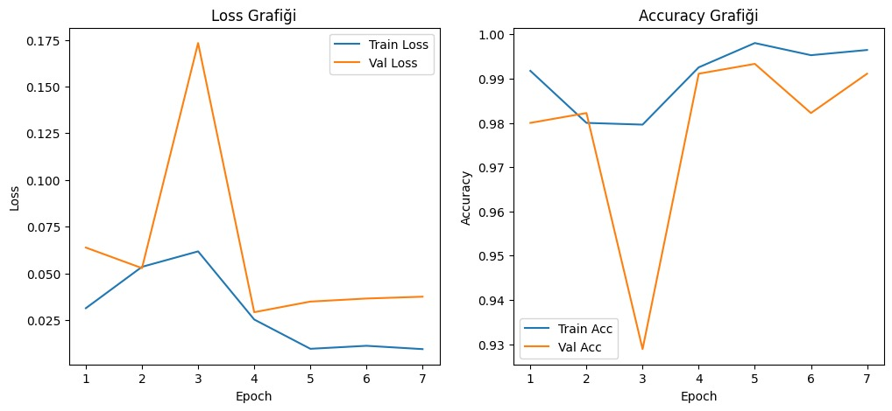
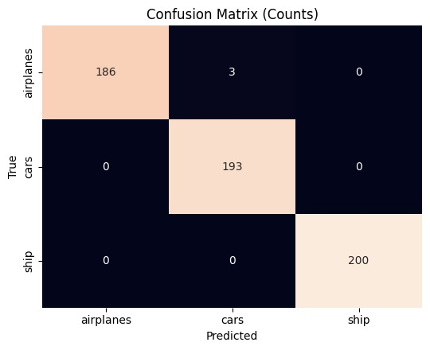
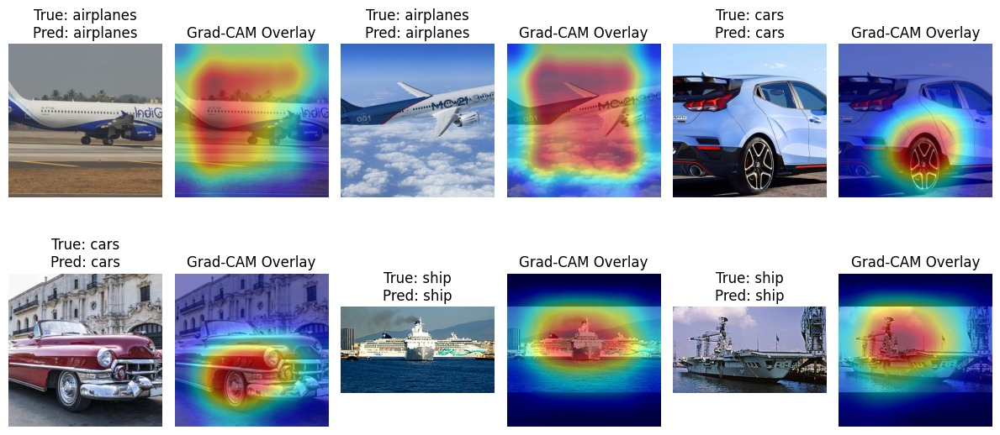

# Airplane–Car–Ship Görsel Sınıflandırma (CNN + Transfer Learning)

## Projenin Amacı
Bu projenin amacı, uçak, araba ve gemi görsellerini ayırt edebilen bir derin öğrenme sınıflandırma modeli geliştirmektir.  
Proje kapsamında veri önişleme, model geliştirme, değerlendirme ve hiperparametre optimizasyonu adımları uygulanmıştır.

---

## Veri Seti
- **Kaynak:** [Kaggle Dataset – Airplane/Car/Ship Classification](https://www.kaggle.com/datasets/umutyldz26/dataset-akbank-classification)
- **Tür:** Multiclass Image Classification (3 sınıf)  
- **Sınıflar:** Airplane, Car, Ship  
- **Bölünme:** Train (%85) → Validation (%15), ayrıca ayrı bir Test seti  

---

## Kullanılan Yöntemler
- **Veri Önişleme:**
  - Oranı koruyarak `letterbox + resize (224×224)`
  - Train tarafında data augmentation (rotation, horizontal flip)
  - Normalize (ImageNet mean/std)
- **Model:**
  - CNN tabanlı ResNet18 (ImageNet ön-eğitimli, son katman 3 sınıfa uyarlandı)
  - Bileşenler: Convolution, Pooling, Dropout, Dense, ReLU, Softmax
- **Eğitim:**
  - Optimizer: Adam
  - Loss: CrossEntropy
  - LR Scheduler: ReduceLROnPlateau
  - Early Stopping
- **Değerlendirme:**
  - Accuracy/Loss grafikleri
  - Confusion Matrix & Classification Report
  - Grad-CAM ve Eigen-CAM görselleştirmeleri

---

## Elde Edilen Sonuçlar
- **Validation Accuracy:** ~%98–99  
- **Test Accuracy:** **%99.48**  
- **Sınıf Bazlı Sonuçlar (Test seti, 582 örnek):**

              precision    recall  f1-score   support

   airplanes     0.9947    0.9894    0.9920       189
        cars     0.9897    0.9948    0.9922       193
        ship     1.0000    1.0000    1.0000       200

    accuracy                         0.9948       582
   macro avg     0.9948    0.9947    0.9948       582
weighted avg     0.9949    0.9948    0.9948       582

**Eğitim Grafikleri:**  
  

**Confusion Matrix:**  
  

**Grad-CAM Örneği:**  
  

---

## Hiperparametre Optimizasyonu
Farklı öğrenme oranı (lr), batch size, weight decay (wd) ve freeze ayarları denendi.  
Aşağıdaki tablo en iyi validation loss/accuracy değerlerini özetlemektedir:

    lr	batch	wd	freeze	best_val_loss	best_val_acc
0	0.0001	32	0.00005	0	0.007256	0.997778
1	0.0005	32	0.00010	1	0.011709	0.995556
2	0.0005	64	0.00010	0	0.017508	0.995556
3	0.0010	32	0.00010	0	0.023525	0.993333
4	0.0005	32	0.00010	0	0.036761	0.98888

---

## Overfitting/Underfitting Yorumu
- Train ve validation eğrileri paralel ilerledi, belirgin overfitting gözlemlenmedi.  
- Hafif dalgalanmalar için data augmentation ve LR scheduler yeterli oldu.  
- Gerekirse dropout/weight decay artırılarak daha güçlü regularization uygulanabilir.  

---

## Model İzleme (Bonus)
- TensorBoard ile eğitim metrikleri loglandı.  
- (Opsiyonel) Weights & Biases entegrasyonu da yapılabilir.  

---

## Model Ağırlıkları
Eğitim sonrası en iyi model `best_model.pth` dosyası olarak kaydedilmiştir.  
Bu dosya **Kaggle Notebook → Outputs sekmesinden** indirilebilir.  
GitHub’a yüklenmemiştir (dosya boyutu büyük olabilir).  

--- 

## Kullanım
Eğitim sonrası en iyi model `best_model.pth` kaydedildi

## 🔗 Kaggle Notebook
[Kaggle’da görüntüle](https://www.kaggle.com/code/umutyldz26/bootcamp-egitim)
[Veri seti] ()